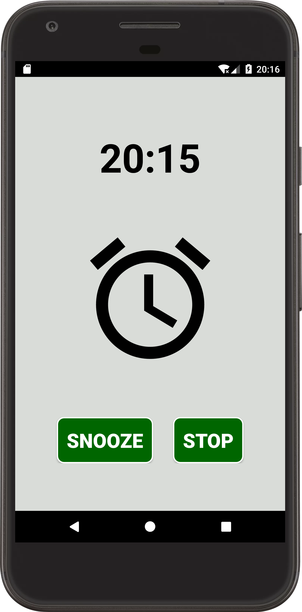

# AlarmClock
AlarmClock created in Android Studio

Press Add menu item to add a new alarm clock.

Choose needed time and repeatability.

When the alarm clock triggers the screen turns on, ringtone starts playing, alarm clock image view begins animation.

Press snooze or stop buttons to delay alarm clock for 5 minutes or stop alarm clock ringing.

SQLiteDatabase is used to save alarm clockes.

BroadcastReceiver makes AlarmManager to work if device was rebooted.

  
